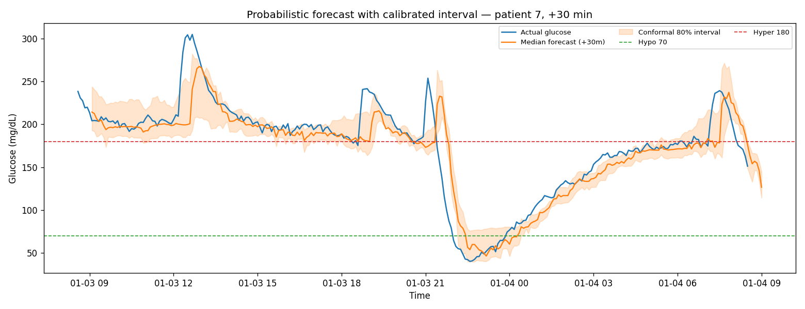
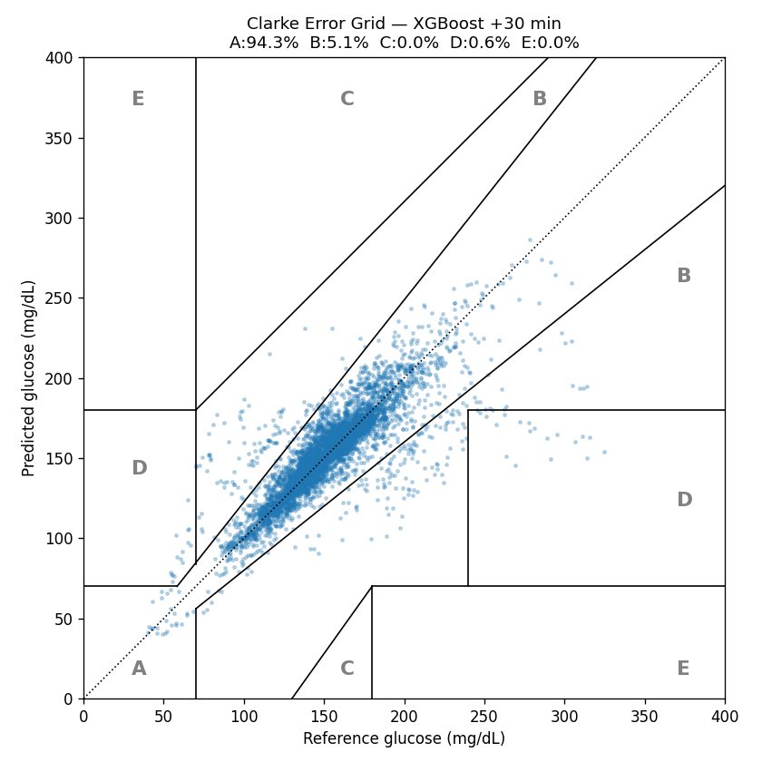
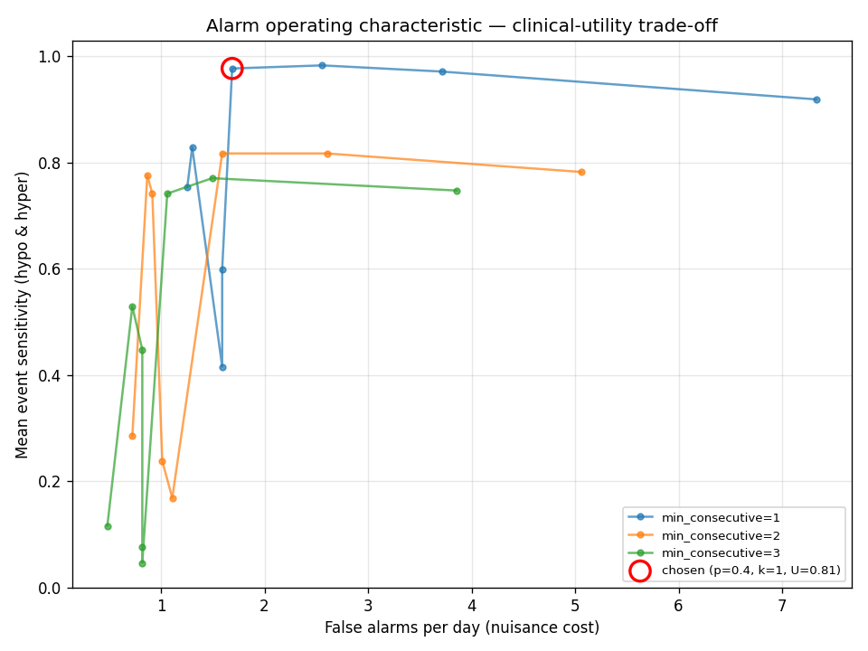
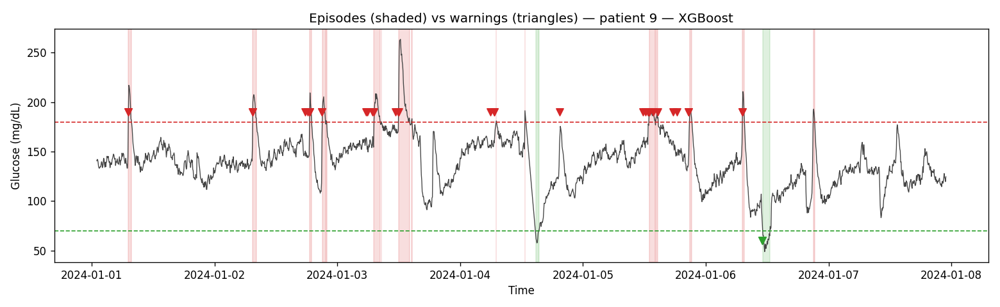

# Glucose Forecasting & Early-Warning System

Forecast short-term blood glucose from continuous glucose monitor (CGM)
time-series, and turn those forecasts into **early warnings** for impending
hypoglycemic (< 70 mg/dL) and hyperglycemic (> 180 mg/dL) events — so a
caregiver can act *before* the event happens.

> Resume line this implements: *"Developed a Python time-series machine
> learning model to forecast short-term blood glucose levels from continuous
> sensor data, surfacing early warnings for potential hypoglycemic and
> hyperglycemic events."*

Everything runs on a laptop with **no GPU and no proprietary data**:
`python main.py` generates realistic CGM data, tunes and trains the models,
evaluates them, and saves plots.

---

## ⚠️ Disclaimer

This is a **research / educational project**. It is **not** a medical device,
not a clinical decision-support tool, and must **not** be used to make
treatment decisions. The default data is **synthetic**. Real glucose
management requires validated devices and licensed clinicians.

---

## What it does

**Data (two backends behind one interface)**
- **Built-in physiological generator** (default): circadian baseline +
  metabolic drift + explicit **carbs / insulin / activity** channels (meals,
  boluses with dose error, exercise) each with its own effect curve, AR(1)
  sensor noise, per-patient sensor calibration bias, and dropout gaps.
- **`simglucose` (UVA/Padova)** validated T1D simulator via
  `--source simglucose` — a real(-istic) second data source. Natively provides
  carbs and insulin.
- **CSV loader** and an **OhioT1DM XML loader** for real exports.

**Modeling**
- **Causal features**: lagged glucose, rate-of-change/acceleration, rolling
  stats, circadian sin/cos, and exogenous **IOB** (insulin-on-board), **COB**
  (carbs-on-board) and **activity load** (all causal decaying accumulations).
- **Per-horizon models (15/30/60 min)**: persistence & linear-extrapolation
  baselines, **XGBoost** (primary; auto-falls back to scikit-learn
  `HistGradientBoostingRegressor` if OpenMP is missing), and an optional
  **LSTM** (PyTorch, guarded).
- **Nested time-series hyperparameter tuning**: expanding-window CV *inside*
  the development set selects XGBoost hyperparameters; held-out patients are
  the untouched outer loop. No leakage.

**Uncertainty & alarms**
- **Conformalized quantile regression (CQR)**: calibrated 80% prediction
  intervals + a predictive CDF giving per-sample **P(hypo)** / **P(hyper)**.
- **Early-warning system**: threshold/probability crossing with hysteresis;
  each alert records fire time, predicted event time, severity/confidence, and
  the triggering horizon.
- **Per-patient calibration**: validation-gated affine adaptation to an
  individual's earliest data (guarded against negative transfer).
- **Clinical-utility tuning**: sweeps the alarm probability threshold ×
  hysteresis and picks the operating point maximizing
  `sensitivity − w · false_alarms_per_day`.

**Evaluation**: RMSE/MAE, **Clarke Error Grid** (zones A–E), sample-level
event detection (sensitivity/specificity/precision/F1), warning-system
metrics (episode sensitivity, median lead time, false alarms/day), conformal
coverage, and 5 saved plots.

---

## Quick start

```bash
python -m venv .venv && source .venv/bin/activate      # Windows: .venv\Scripts\activate
pip install -r requirements.txt
python main.py
```

Runs the full pipeline (~50 s on a laptop CPU), prints the tables, and writes
plots to `outputs/`.

```bash
python main.py --source simglucose --patients 5 --days 3   # validated simulator
python main.py --csv data.csv --ts-col time --glucose-col mg_dl
python main.py --fast          # skip tuning/conformal/calibration/utility (~12 s)
python main.py --no-lstm --no-tune --no-utility
```

macOS note: XGBoost needs OpenMP (`brew install libomp`); if it's missing the
code auto-falls back to scikit-learn histogram gradient boosting.

---

## Sample results (synthetic, held-out patients 7/8/9, seed 42, reproducible)

Default run: 10 virtual patients × 7 days, 3 patients fully held out for test.

**Forecast accuracy & Clarke grid — XGBoost beats the baselines at every horizon:**

| Model         | Horizon | RMSE  | MAE   | Clarke A % | Clarke A+B % |
|---------------|:-------:|:-----:|:-----:|:----------:|:------------:|
| Persistence   |  15 min | 14.07 |  7.69 |   96.6     |    99.7      |
| **XGBoost**   |  15 min |**10.58**|**6.04**| **98.1** |    99.7      |
| LSTM          |  15 min | 12.54 |  6.94 |   97.4     |    99.7      |
| Persistence   |  30 min | 21.60 | 12.34 |   89.7     |    99.1      |
| **XGBoost**   |  30 min |**17.28**|**10.07**| **94.3**|    99.4      |
| LSTM          |  30 min | 18.42 | 10.42 |   93.9     |    99.3      |
| Persistence   |  60 min | 29.82 | 18.59 |   79.8     |    98.5      |
| **XGBoost**   |  60 min |**20.96**|**13.32**| **89.5**|    99.2      |
| LSTM          |  60 min | 22.87 | 14.04 |   89.1     |    98.9      |

Nested time-series CV selected `n_estimators=200, max_depth=4, lr=0.05`.
On the **simglucose** simulator, XGBoost reaches **7.6 / 12.7 / 16.5 mg/dL**
RMSE at 15/30/60 min.

**Conformal 80% prediction intervals (test set):**

| Horizon | Target cov. | Empirical cov. | Mean width (mg/dL) |
|:-------:|:-----------:|:--------------:|:------------------:|
| 15 min  |    0.80     |     0.85       |       19.1         |
| 30 min  |    0.80     |     0.83       |       28.9         |
| 60 min  |    0.80     |     0.84       |       41.2         |

**Early-warning system (deterministic, XGBoost, all horizons):**

| Event         | Episodes | Detected | Sensitivity | Median lead | False alarms/day |
|---------------|:--------:|:--------:|:-----------:|:-----------:|:----------------:|
| Hyper (> 180) |    86    |    66    |    0.77     |   40 min    |      1.16        |
| Hypo (< 70)   |     4    |     2    |    0.50     |    5 min    |      0.00        |

**Clinical-utility operating point** (chosen by sweeping the alarm knob):
`P(cross) ≥ 0.40, hysteresis = 1` → mean sensitivity **0.98**, **1.69**
false alarms/day, **21 min** mean lead time.

Sample-level event-detection F1 (XGBoost, 15 min): **0.82** hyper, **0.81**
hypo, at ≥ 97% specificity. Per-patient calibration is roughly **neutral** here
— an honest finding: the autoregressive features already capture each patient's
level, so static recalibration adds little, and the validation gate prevents
it from hurting. Exact numbers reproduce from `outputs/run_log.txt` and
`outputs/metrics_full.csv`.

### Plots (saved to `outputs/` on every run)

| File | What it shows |
|------|---------------|
| `prediction_overlay.png`  | Forecast vs actual on a sample day, warning markers |
| `forecast_intervals.png`  | Median forecast + conformal 80% band vs actual |
| `clarke_grid.png`         | Clarke Error Grid scatter with zone % |
| `warning_timeline.png`    | True episodes (shaded) vs warnings (triangles) |
| `utility_curve.png`       | Sensitivity vs false-alarms/day, with chosen operating point |

Sample outputs from a default run:

**Probabilistic forecast with calibrated conformal interval** (the band widens
during volatility and captures a deep hypo excursion):



**Clarke Error Grid** &nbsp;|&nbsp; **Alarm operating characteristic (utility trade-off)**

<p float="left">
  
  
</p>

**Episodes (shaded) vs. where warnings fired (triangles):**



---

## Project structure

```
glucose-forecast/
├── README.md            # this file
├── requirements.txt     # core pinned; simglucose + torch optional
├── main.py              # runs the whole pipeline end to end
├── data/
│   └── generate.py      # simglucose wrapper + physiological generator (carbs/insulin/activity)
├── src/
│   ├── config.py        # thresholds, horizons, seed, conformal/tuning/utility knobs
│   ├── load.py          # CSV + OhioT1DM loaders, common data interface
│   ├── preprocess.py    # 5-min resample, gap handling, segmentation
│   ├── features.py      # causal features incl. IOB / COB / activity
│   ├── models.py        # baselines, XGBoost/HistGBR, optional LSTM, quantile factory
│   ├── conformal.py     # CQR intervals + crossing probabilities
│   ├── tuning.py        # nested time-series CV + per-patient calibration
│   ├── warnings.py      # deterministic + probabilistic alert logic
│   ├── utility.py       # clinical-utility sweep of the alarm operating point
│   └── evaluate.py      # metrics, Clarke grid, warning scoring, plots
└── outputs/             # metrics CSVs + PNGs (created on run)
```

---

## Design notes

- **One model per horizon** — a 60-min forecast is a different problem from a
  15-min one; separate models stay directly comparable to the baselines.
- **Leakage-free by construction** — features use only past/present values;
  targets are future glucose within the *same* gap-free segment; whole patients
  are held out for test; tuning CV lives entirely inside the dev set.
- **Runs anywhere** — XGBoost→HistGBR fallback, torch-guarded LSTM, and
  simglucose-optional data all degrade gracefully.

## Limitations & what's next

The synthetic generator is physiologically *plausible* but simplified (no full
insulin pharmacokinetics, stylized activity), so treat the numbers as a
pipeline demonstration. The **simglucose** path addresses part of the
"real data" gap; a full study would add **OhioT1DM** (loader included; needs a
data-use agreement) and Tidepool. Further work: richer exogenous physiology
(heart rate, sleep), deeper per-patient **personalization** (fine-tuning rather
than affine recalibration, which the AR features already subsume), multi-output
sequence models, and tuning the utility weight `w` on a real
care-setting cost model for missed events vs. alarm fatigue.
